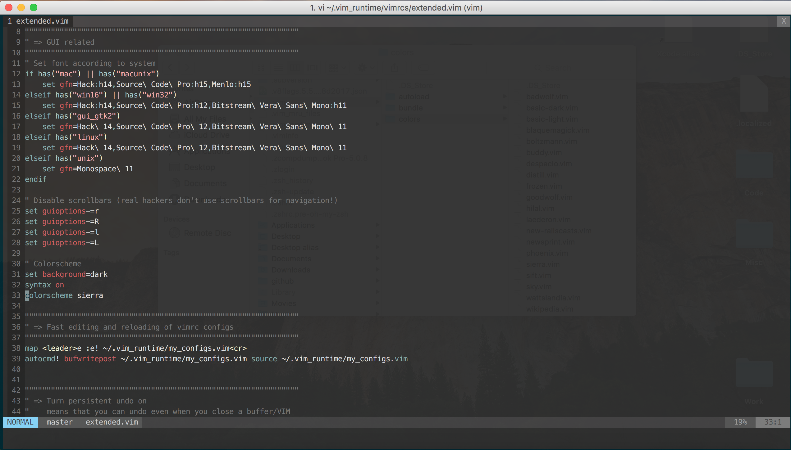
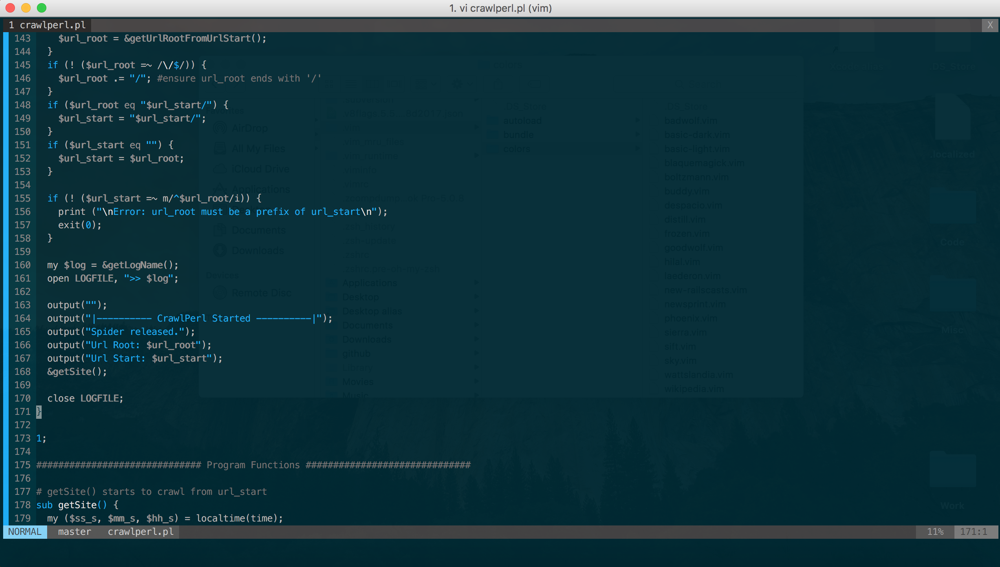
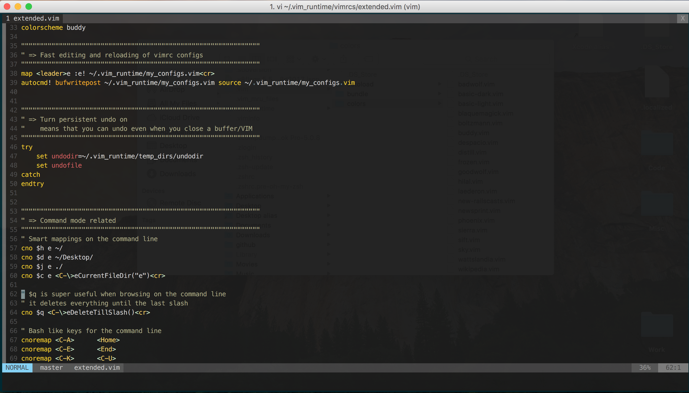
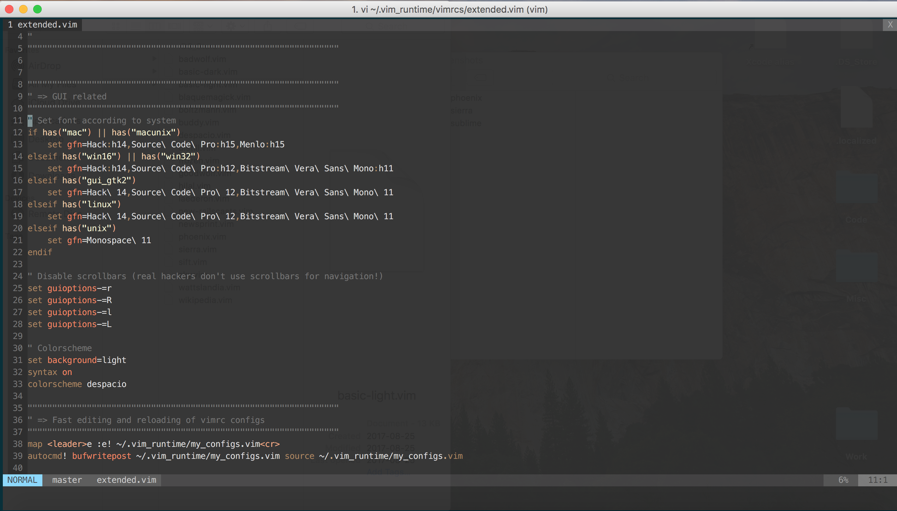

# Vim Setup

## Useful Tools
- Custom editor setup, the screen is now set up to look like a modern text editor
- Line numbers are added
- Vundle comes installed
- Cleaner interface

## Installation
- Add all the files to your home directory
- Edit your current color scheme in your vim configurations to the name of the vim script you want to use

## Change Colour Theme
- In `~/.vim_runtime/vimrcs/extended.vim` on line 33, change the variable to the prefix of the filename containing the colour script

## Screenshots
### Sierra

### Phoenix

### Sublime

### Despacio

